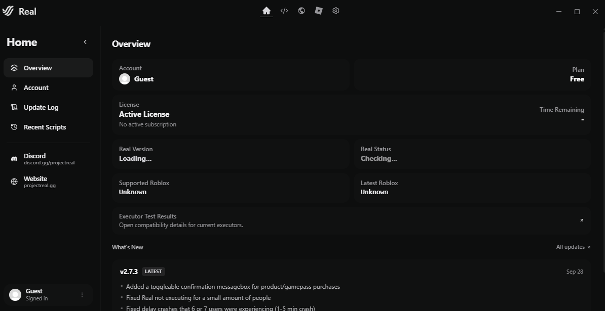
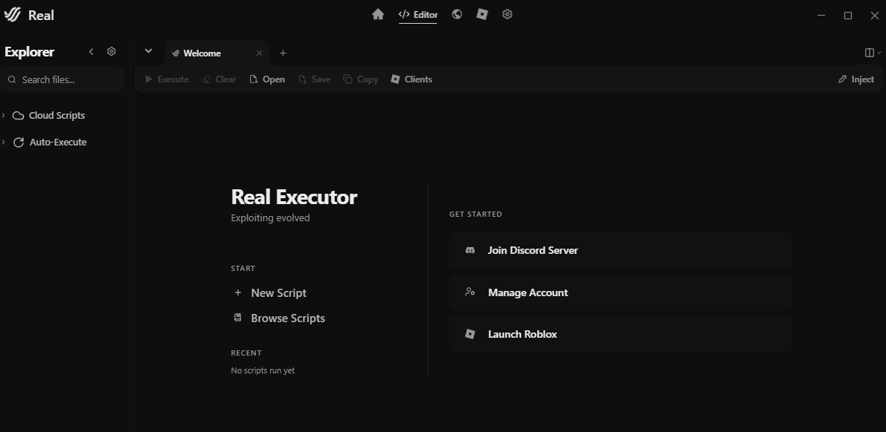
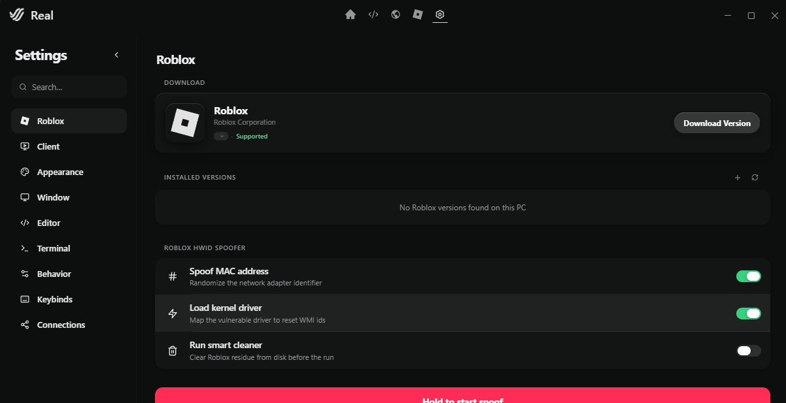

# RealExecutor Frontend 2.7.2

Standalone browser package containing the recovered Real frontend assets for version **2.7.2**.

## Preview

| Home | Editor | Settings |
|---|---|---|
|  |  |  |

## Run

Requirements: Windows and Python 3.

```powershell
.\run.ps1
```

The launcher starts a local static server and opens the frontend in your default browser. It does not require Node.js, npm, or a global package installation.

## Scope

This repository contains the frontend only: the recovered SvelteKit assets, Monaco editor, styles, icons, and browser-safe fallback layer. It is intended for UI inspection and frontend development.

Native desktop operations are intentionally unavailable in this frontend-only package. In particular, process manipulation, injection, memory operations, and native IPC are not included. A complete native build requires the separately maintained backend and its original runtime dependencies.

## Repository layout

- `_app/immutable/` — compiled application modules and styles.
- `monaco/` — bundled Monaco editor assets.
- `icons/`, `background/`, `lottie/`, `providers/` — static UI resources.
- `docs/screenshots/` — real application screenshots used in this README.
- `index.html` — standalone entry point with the browser fallback layer.
- `run.ps1` / `run.cmd` — one-command local launcher.

## Version

Frontend target: `2.7.2`.

This project is a recovered frontend distribution. It does not claim to be the original upstream source repository; changes should preserve the existing frontend contracts and avoid inventing backend behavior.
